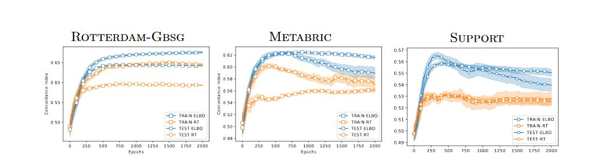
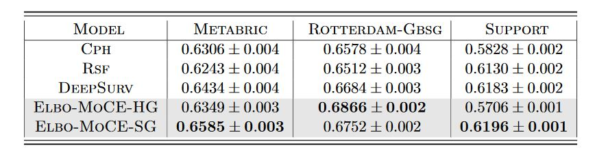
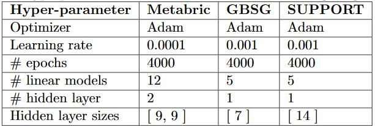

<h3>Nonlinear Semi-Parametric Models for Survival Analysis</h3>

<p>
  This repository contains code-base for https://arxiv.org/abs/1905.05865
</p>

<h5> Generating the results </h5>

<p> The results presented in the paper can be reproduced by executing the following command: <br>
  
  ```
  python MoCE.py
  python MoCE_results.py
  ```
 </p>

<h4>Generated Results </h4>



<p align='center'> Figure 1: Concordance Index comparision on various dataset </p>


<p align='center'> Table 1:  Results of hard and soft linear gating networks and their comparison with relevantbaselines (95% bootstrap CI ). </p>


<p align='center'> Table 2:  Results of hard and soft non-linear gating networks and their comparison with relevantbaselines (95% bootstrap CI ). </p>

<h4>Hyper Parameters for Hard and Soft Gating </h4>


<p> Table 3: Hyperparameters for different datasets with hard-gating network</p>


<p> Table 4: Hyperparameters for different datasets with soft-gating network</p>


